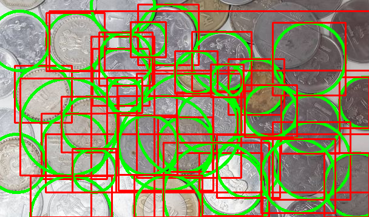
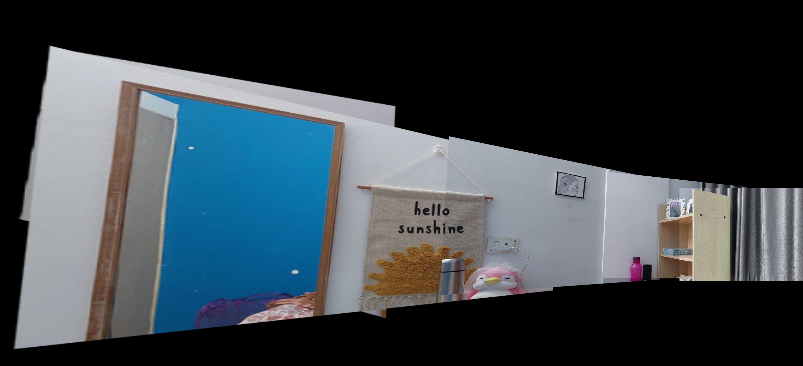

# **VR_Assignment1_AnukritiSingh_MS202450**  
## **Coin Detection, Segmentation, and Panorama Creation**  

### **Methods Used**  
#### **Coin Detection and Segmentation**  
- **Hough Circles Transform**: This technique is chosen due to its effectiveness in detecting circular objects even in cluttered backgrounds.  
- **Why Not Canny Edge Detector?**  
  - Canny edge detection alone does not differentiate between circles and other edges.  
  - Hough Circles method is specialized for circular object detection, making it more accurate for coin segmentation.  

#### **Panorama Creation**  
The panorama creation is achieved using **feature-based image stitching**. The process involves:  
- Detecting keypoints and computing descriptors using **SIFT (Scale-Invariant Feature Transform)**.  
- Matching keypoints between consecutive images using a **FLANN-based matcher**.  
- Computing a **homography matrix** using RANSAC to align images.  
- Warping images based on homography and blending them to create a seamless panorama.  
- Resizing images to a common height for better alignment and visualization.  
This method ensures robust image stitching, even with perspective variations.  

---
### **Running the Code**  
#### **Prerequisites**  
Ensure you have Python installed along with the necessary dependencies. You can install them using:  
```bash
pip install -r requirements.txt
```
### **Coin Detection and Segmentation**
Run the following command to detect and segment coins in an image:
```bash 
python coin_detection_segmentation.py
```
- Input: input_coins.jpg
- Output: detected_coins.png (coins detected with bounding boxes and circles)
#### **Total number of coins detected: 35**
### Detected Coins


### **Panorama Creation**
To generate a panorama from multiple images:
```bash 
python panorama_creation.py
```
- Output: images_panorama/panorama.jpeg
### Panorama Output

